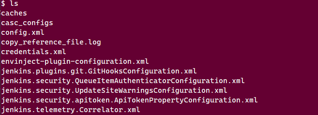
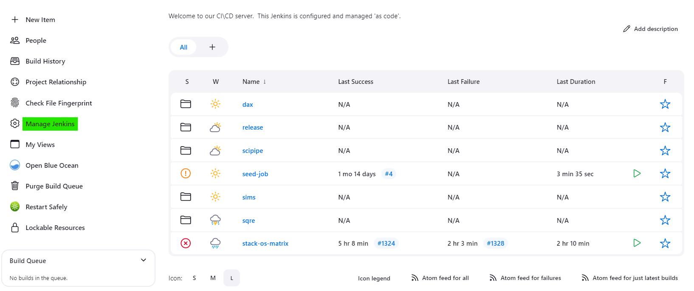
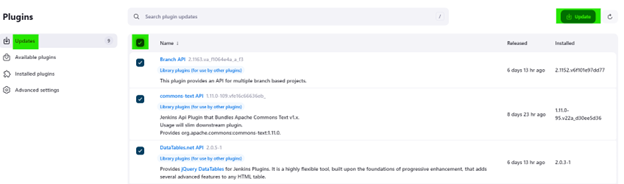

# Seed Jobs, Installation, and [Step-by-Step Upgrade Guide for Jenkins](#upgrading-jenkins-step-by-step-guide)

## Seed Jobs

This directory is for seed jobs for jenkins. Whilst it is in theory possible to
configure seed jobs via the helm file, it seems the groovy inside yaml inside
yaml breaks, and so having the groovy files be separate is a smarter thing to
do.

It appears that the original seed job system was based on
<https://github.com/sheehan/job-dsl-gradle-example/>. It is worth referring to
that repository to understand how seed jobs are set up.

### Why use Helm to set up Jenkins

As per <https://www.jenkins.io/doc/book/installing/kubernetes/>, there are three
ways of installing jenkins into a kubernetes cluster:

* Use the kubernetes operator
* Use the provided helm chart
* Manually define the setup using standard kubernetes objects

Whilst using the kubernetes operator would be ideal, the way it is currently set
up requires that all plugins and jobs are predefined, and there appears to be no
long term storage of config or runs. As jenkins plugins can be quite finicky,
this involves large amounts of trial and error.

Whilst manually setting up the system might give more control of the system, it
does involve more maintenance overhead than the other two options, and does not
allow as easy configuration of the system.

## Installation

### Setting up Helm for installing Jenkins

See <https://helm.sh/docs/intro/install/> for how to install helm.

Once helm is installed, you need to add the helm repository containing the
jenkins helm charts:

```
helm repo add jenkinsci <https://charts.jenkins.io>
```

This should now appear on the list of installed repositories that appear by
running `helm repo list`.

### Installing Jenkins via Helm

As per <https://helm.sh/docs/intro/using_helm/>, running:

```
helm install -n <namespace_to_use> <install_name> jenkinsci/jenkins -f <config>
```

will install the jenkins helm chart with the config that has been specific in
the given files.

You should not need to modify the files too much, but there are certain sections
you will want to be familiar with:

* `installPlugins` and `additionalPlugins`: Plugins needed for the system.
   Jenkins is a bit picky about versions, so you may need to work out which
   plugins are leaf plugins and install those, rather than trying to lock
   everything.
* `JCasC`: This is where jenkins config is injected. Things like security
   properties, seed jobs and authentication are configured here.
* `ingress`: This is where we configure external access to jenkins.

## Upgrading Jenkins Step-by-Step Guide

### Backing up Current Jenkins State

Before Jenkins can be properly updated, the state must be backed up.
Jenkins state is currently stored in a tarball at s3df under the directory
`/sdf/home/r/ranabhat/prod_jenkins/`.

* Jenkins persistent volume (state) is in the directory `/var/jenkins_home`
  on the pod. To preserve the state, we tar the contents of `jenkins_home`
  to SLAC s3df. The transfer will take about an hour.
* Check that you have `ssh` access to s3df with:
   * __ssh *YOUR_USERNAME*@sdfdtn001.slac.stanford.edu__

1. Ensure that no jobs are running at <https://rubin-ci.slac.stanford.edu/>.
   If there are jobs running during an update, cancel those jobs and notify the
   owners of the jobs via the slack channel `dm-jenkins`. Ensure the jobs are
   cancelled completely before beginning the backup.
1. On cluster `rubin-jenkins-control`, `exec` into the jenkins container
   on the production pod:

   ```
   kubectl exec prod-jenkins-0 -n jenkins-prod -it -- sh
   ```

1. Move to the `jenkins_home` directory: `cd /var/jenkins_home` - it should
   start like this:
   
1. Tar the contents of the folder (excluding the . and .. directories) to s3df.
   Replace YOUR_USERNAME and DATE appropriately in the code block below:

   ```
   tar czf -  \
     --directory=/var/jenkins_home \
     --exclude=. \
     --exclude=.. \
     * .* | \
   ssh YOUR_USERNAME@sdfdtn001.slac.stanford.edu \
     'cat > /sdf/data/rubin/user/ranabhat/prod_jenkins/prod_jenkins_home_DATE.tar.gz'
   ```

   * DO NOT close this window until the tarball is finished - about 1 hour.
1. In a new terminal, `ssh` into the directory at s3df and `ls -lah` to check
   that the contents are being copied over.
1. Once the contents have been fully copied over, proceed to the next step.

### Updating the Helm Values Files

The helm values files are stored in this repository under
`dev-values.yaml` and `values.yaml`. To upgrade, copy the values file
locally and make changes to it with upgraded version values. Then
upgrade the chart with `helm upgrade` and the new values file. On a
successful upgrade, update the values files in this repo.

#### Upgrade the __Jenkins Version__

Find the most recent `lts-jdk21` version on
[dockerhub](https://hub.docker.com/r/jenkins/jenkins/tags?page=&page_size=&ordering=&name=lts-jdk21)
and replace `controller.image.tag` (found at the top of the values file).

#### Upgrade the __jdk version__

The `jdk21` part of the tag above corresponds to the JDK version
(ie, `lts-jdk17`, `lts-jdk21`).


### Upgrade the __plugins__

1. Navigate to the UI.
   * [Development Jenkins](https://rubin-ci-dev.slac.stanford.edu/)
   * [Production Jenkins](https://rubin-ci.slac.stanford.edu/)
1. Select `Manage Jenkins`
   
1. Select `Plugins`
   
1. Navigate to `Updates` to view available updates for current plugins.
   

There are two ways to go about upgrading the plugins:

* First, __which is the recommended process__, is to manually add the
  updated plugin version (highlighted above in yellow) to the helm values
  file. This allows you to easily catch `breaking upgrades` or
  `additional dependencies`. Additionally, plugin versions will be recorded
  right away in the helm values chart, ensuring there are no
  discrepancies between the values chart and the UI.

   * Add these values to `installPlugins` and `additionalPlugins` in the
     values file:
     
   * If you don't know the installation name of the plugin, click the plugin
     in the UI. This will bring you to a new page, click on 'releases' to see
     the installation name and options.
   * See [Plugin Upgrade Troubleshooting](#plugin-upgrade-troubleshooting)
     for help with common plugin upgrade problems.

* The second way to update the plugins is via the UI. This is __not
  recommended for production__ as updating plugins in the UI can
  cause breaking changes and discrepancies between the UI and the
  helm values config.

   * Check in the UI if there are any
     `breaking upgrades/additional dependencies`
     -- they will be blocked out in red.
   * Click the check box next to `name` at the top of the list and upgrade
     all the plugins.
        
   * Click `Restart Jenkins when installation is complete and no jobs are running`
     in the next window. (Cancel any jobs if you haven't done so).
   * Wait for Jenkins to restart -- if it does not restart, navigate back to
     the home page and click `Restart Safely`.

      * See [Plugin Upgrade Troubleshooting](#plugin-upgrade-troubleshooting)
        if the pod does not spin up.

   * Navigate to `Manage Jenkins` then `Script Console`.
     
   * In the script console, insert the following code and press `run`
     to get a list of the plugins with their updated versions:

   ```
   Jenkins.instance.pluginManager.plugins.each {
      println("${it.getShortName()}: ${it.getVersion()}")
   }
   ```

   
   

   * __Copy the results (ignoring the bit at the end) into the helm values file
     under `installPlugins` and `additionalPlugins`.__

### Plugin Upgrade Troubleshooting

* If the page gets stuck at `503 Service Temporarily Unavailable`
   * Check the pod logs. The `init` container likely is
     crashing due to a missed dependency.
* If the values file in `github` is up-to-date, you can also use
  `helm upgrade` to reset the values:
   * `helm upgrade <release> -n namespace <chart> -f <filename>`
* If still stuck, rollback to the previous release:
   * `helm rollback <release> <rollback-number> -n <namespace>`
   * If `<rollback-number>` is left blank, helm will rollback the
  most recent release.
   * To view previous releases: `helm history <release> -n <namespace>`

## Upgrading the Helm Chart

Once the Jenkins version, JDK version, and plugin versions are all updated
in the helm chart, you can run `helm upgrade` on the release:
`helm upgrade <release> -n namespace <chart> -f <filename>`
For the current production, this will be:

```
helm upgrade prod -n jenkins-prod jenkinsci/jenkins -f values.yaml
```

## Upgrading the Linux agents JDK version

The JDK version of the Linux agents is located in [lsst-dm/docker-jenkins-swarm-client.](https://github.com/lsst-dm/docker-jenkins-swarm-client/blob/6d70a7c072f2762600e6c42dea882683f18bcfdb/Dockerfile#L24)
This version should match the Jenkins control, which can be found under
`Manage Jenkins` > `System Information` > `java.runtime.version`

* After the version is updated, navigate to the LSST Google Cloud
 `jenkins-prod` project.
* In the hamburger menu on the upper RHS, select `Kubernetes Engine`
  and `Workloads`; there you will see a list of the deployed
  [StatefulSet swarm agents.](https://console.cloud.google.com/kubernetes/workload/overview?authuser=1&project=prompt-proto&pageState=(%22savedViews%22:(%22i%22:%22bf849e9642c3422e9896e8f5c5a3089d%22,%22c%22:%5B%5D,%22n%22:%5B%5D)))
* Select a StatefulSet agent.
* Select a pod and delete it (be mindful that you are deleting the
  pod and NOT the StatefulSet). Continue to delete all pods.
   * Deleting the pods will force restart, allowing the pods
     to use the most recent JDK version.
   * Each pod can take up to 15 minutes to respawn, so feel free to delete
     all the agent pods at once to speed up the process.
